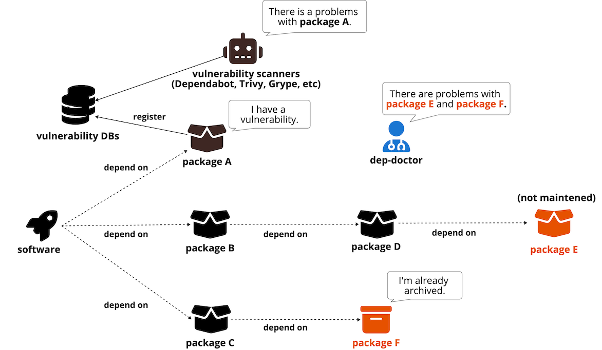
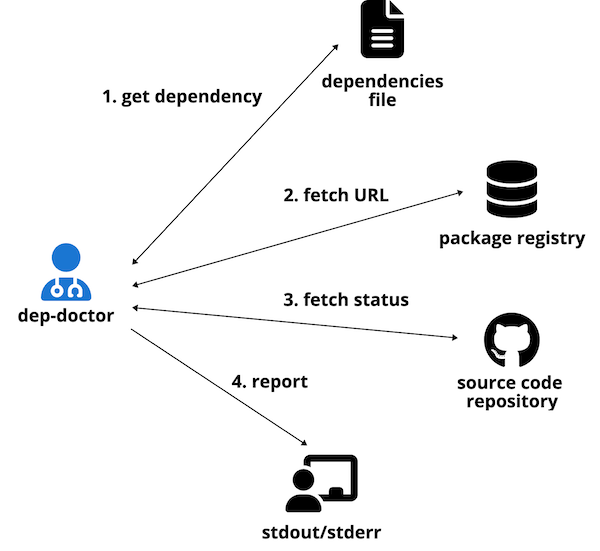

# dep-doctor [](https://coveralls.io/github/kyoshidajp/dep-doctor?branch=main) [](https://pkg.go.dev/github.com/kyoshidajp/dep-doctor)

`dep-doctor` is a tool to diagnose whether your software dependency libraries are maintained.

Today, most software relies heavily on external libraries. Vulnerabilities in those libraries can be detected by vulnerability scanners ([dependabot](https://docs.github.com/en/code-security/dependabot), [trivy](https://aquasecurity.github.io/trivy), [Grype](https://github.com/anchore/grype), etc) if they are publicly available.

However, some libraries have archived their source code repositories or have had their development stopped, although not explicitly. `dep-doctor` will notify you of those libraries in the dependencies file.



## Support dependencies files

| language | package manager | dependencies file (e.g.) | status |
| -------- | ------------- | -- | :----: |
| Dart | pub | pubspec.lock | :heavy_check_mark: |
| Erlang/Elixir | mix | mix.lock | :heavy_check_mark: |
| Go | golang | go.mod | :heavy_check_mark: |
| JavaScript | npm | package-lock.json | :heavy_check_mark: |
| JavaScript | yarn | yarn.lock | :heavy_check_mark: |
| PHP | composer | composer.lock | :heavy_check_mark: |
| Python | pip | requirements.txt | :heavy_check_mark: |
| Python | pipenv | Pipfile.lock | :heavy_check_mark: |
| Python | poetry | poetry.lock | :heavy_check_mark: |
| Ruby | bundler | Gemfile.lock | :heavy_check_mark: |
| Rust | cargo | Cargo.lock | :heavy_check_mark: |
| Swift | cocoapods | Podfile.lock | :heavy_check_mark: |

## Support repository hosting services

Only GitHub.com

## Install

### Homebrew (macOS and Linux)

```console
$ brew tap kyoshidajp/dep-doctor
$ brew install kyoshidajp/dep-doctor/dep-doctor
```

### Binary packages

[Releases](https://github.com/kyoshidajp/dep-doctor/releases)

## How to use

`GITHUB_TOKEN` must be set as an environment variable before execution.

```console
Usage:
  dep-doctor diagnose [flags]

Flags:
      --disable-cache    without using cache
  -f, --file string      dependencies file path
  -h, --help             help for diagnose
  -i, --ignores string   ignore dependencies (separated by a space)
  -p, --package string   package manager
      --strict           exit with non-zero if warnings exist
  -y, --year int         max years of inactivity (default 5)
```

For example:

```console
$ dep-doctor diagnose --package bundler --file /path/to/Gemfile.lock
concurrent-ruby
dotenv
faker
i18n
method_source
paperclip
......
[error] paperclip (archived): https://github.com/thoughtbot/paperclip
Diagnosis completed! 6 dependencies.
1 error, 0 warn (0 unknown), 0 info (0 ignored)
```

## Report level

| level | e.g. |
| :---: | :---------- |
| *error* | Source code repository is already archived. |
| *warn* | Source code repository is not active or unknown. |
| *info* | Other reasons. (specified to be ignored) | |

## Useful options

### `--year`

The maximum number of blank years to be considered maintained. A source code repository is considered maintained if it has been committed within this number of years.

The default is `5` years, but if longer is desired, for example

```console
$ dep-doctor diagnose --package bundler --file /path/to/Gemfile.lock --year 7
```

In the above case, if there are commits within the last 7 years, it is considered to be maintained.

### `--ignores`

You can specify libraries not to notify you of errors or warnings. This may be useful if you plan to address the issue in the near future but wish to ignore it at this time.

Please specify this option with the understanding that there is a risk.

If there is more than one, you can specify each one separated by a space as follows.

```console
$ dep-doctor diagnose --package bundler --file /path/to/Gemfile.lock \
  --ignores "lib1 lib2 lib3"
```

### `--disable-cache`

When a status result is retrieved from the source code repository, the URL is kept in a file as a cache (`.dep-doctor.yml`). Normally, the repository URL is not changed frequently. To speed up the running, this cache is referenced on the second and subsequent runs.

With the `--disable-cache` option, this cache is not referenced. It always retrieves the latest source code URL from the package registry.

## GitHub Actions

Installs an dep-doctor binary for Linux(x86_64) into /usr/local/bin. This action runs install only.

```yml
jobs:
  diagnose:
    name: dep-doctor
    runs-on: ubuntu-latest
    steps:
      - uses: actions/checkout@v4
      - uses: kyoshidajp/dep-doctor@v1
        with:
          version: v1.0.0 # or latest
      - run: dep-doctor diagnose --package golang --file go.mod
        env:
          GITHUB_TOKEN: ${{ secrets.GITHUB_TOKEN }}
```

## How it works



## Author
Katsuhiko YOSHIDA
